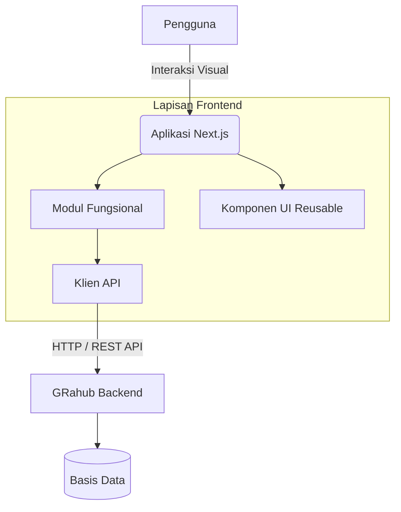

# GRahub Frontend Repository

Repositori ini memuat kode sumber untuk aplikasi antarmuka pengguna (frontend) dari sistem GRahub, sebuah platform manajemen komunitas terpadu. Sistem ini dirancang untuk memfasilitasi administrasi kependudukan pada tingkat RT, RW, dan Kelurahan secara efisien dan profesional.

## Arsitektur Sistem

Aplikasi ini dibangun menggunakan arsitektur modular dengan pemisahan tanggung jawab yang jelas antara komponen antarmuka, tata letak, dan lapisan integrasi data.



## Spesifikasi Teknis

- **Kerangka Kerja**: Next.js 15 (App Router)
- **Bahasa Pemrograman**: TypeScript
- **Penataan Gaya (Styling)**: CSS Modules Murni (Vanilla CSS) dengan CSS Variables
- **Ikonografi**: Lucide React

## Struktur Direktori

Kode sumber diatur dengan pedoman struktur yang ketat untuk memastikan skalabilitas dan kemudahan pemeliharaan jangka panjang:

- `src/app/(main)/` : Berisi seluruh rute dan modul fungsional utama.
- `src/components/layout/` : Memuat struktur dasar antarmuka (Header, Sidebar, Footer).
- `src/components/ui/` : Komponen antarmuka mandiri yang dapat digunakan kembali (Tabel, Dialog, Tombol).
- `src/lib/api/` : Kumpulan fungsi klien API dan antarmuka tipe data yang selaras secara presisi dengan skema basis data backend.

Setiap modul diwajibkan untuk secara konsisten mengikuti pola arsitektur berikut:

1. `page.tsx`: Berfungsi sebagai halaman utama, mengelola status dan pengambilan data dari server.
2. `_components/data-table.tsx`: Bertanggung jawab atas representasi tabular, pencarian data, serta aksi terkait.
3. `_components/modal-create.tsx`: Menangani formulir penambahan entitas.
4. `_components/modal-detail.tsx`: Menampilkan rincian entitas dalam mode baca.
5. `_components/modal-update.tsx`: Menangani formulir modifikasi entitas.

## Persyaratan Sistem

Sebelum menjalankan aplikasi, pastikan sistem pengembangan telah memenuhi spesifikasi minimum berikut:

- Node.js versi 18.x atau yang lebih baru.
- NPM versi 9.x atau yang lebih baru.
- Konektivitas yang aktif menuju layanan GRahub API.

## Panduan Instalasi

1. **Instalasi Dependensi**
   Unduh dan pasang seluruh modul yang terdaftar dalam konfigurasi proyek:
   ```bash
   npm install
   ```

2. **Menjalankan Server Pengembangan**
   Jalankan server lokal untuk menguji dan memodifikasi aplikasi secara langsung:
   ```bash
   npm run dev
   ```
   Aplikasi dapat diakses melalui peramban pada alamat `http://localhost:3000`.

3. **Kompilasi Produksi**
   Lakukan kompilasi proyek untuk persiapan perilisan (deployment):
   ```bash
   npm run build
   npm run start
   ```

## Standar Pengembangan (Panduan Kontribusi)

Setiap kontributor diwajibkan untuk mematuhi regulasi pengembangan berikut:

1. Hindari penggunaan pustaka penataan gaya eksternal selain konfigurasi CSS bawaan yang telah ditetapkan.
2. Manfaatkan token desain pada `globals.css` untuk warna, jarak, serta dimensi agar konsistensi antarmuka tetap terjaga.
3. Pastikan tidak ada modifikasi tipe data yang menyimpang dari skema backend. Seluruh kontrak data klien (API interfaces) harus sejalan penuh dengan struktur pangkalan data.
4. Antarmuka wajib mempertahankan kompatibilitas lintas perangkat (Desktop, Tablet, Mobile) menggunakan teknik desain responsif yang tepat.
